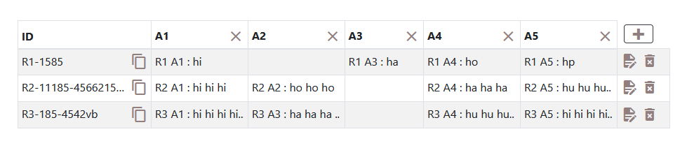

An easy to use interactive table generation JavaScript 

Full documentation & demos can be found at: [https://jamalamch.github.io/Gx_table](https://jamalamch.github.io/Gx_table)
***

***

Features
================================
Gx_table allows you to create interactive tables in seconds from any HTML Table, Javascript Array or JSON formatted data.

Simply include the library and the css in your project and you're away!


Setup
================================
Setting up Gx_table could not be simpler.

Include the library and the css
```html
    <link rel="stylesheet" href="https://cdn.jsdelivr.net/npm/bootstrap@4.5.3/dist/css/bootstrap.min.css" >
    <link rel="stylesheet" href="https://cdn.materialdesignicons.com/5.6.55/css/materialdesignicons.min.css">
    <link rel="stylesheet" href="https://cdn.jsdelivr.net/npm/gx-table@1.0.0/gx-table.css">

    <script src="https://code.jquery.com/jquery-3.5.1.slim.min.js"></script>
    <script src="https://cdn.jsdelivr.net/npm/bootstrap@4.5.3/dist/js/bootstrap.bundle.min.js"></script>
    <script src="https://cdn.jsdelivr.net/npm/gx-table@1.0.0/gx-table.js" ></script>
```

Create an element to hold the table
```html
<div class="container">
....
......    
</div>
```

Turn the element into a tabulator with some simple javascript
```js
var table = $('.container').gxTable({
    tableName: 'table Gx',
    columns: [
        "A1", "A2", "A3", "A4", "A5"
    ],
    data: {
        "R1-1585": {
            A1: " R1 A1 ",
            A3: " R1 A3 ",
            A4: " R1 A4 ",
            A5: " R1 A5 "
        },
        "R2-11185-45vb": {
            A1: " R2 A1 ",
            A2: " R2 A2 ",
            A4: " R2 A4 ",
            A5: " R2 A5 "
        },
        "R3-185-4542vb": {
            A1: " R3 A1 ",
            A2: " R3 A2 ",
            A2: " R3 A3 ",
            A4: " R3 A4 ",
            A5: " R3 A5 "
        }
    }
});
```

### NPM Installation
To get Tabulator via the NPM package manager, open a terminal in your project directory and run the following commmand:
```
npm i gx-table
```

### CDN - UNPKG
To access Tabulator directly from the UNPKG CDN servers, include the following two lines at the start of your project, instead of the localy hosted versions:
```html
<link rel="stylesheet" href="https://cdn.jsdelivr.net/npm/gx-table@1.0.0/gx-table.css">
<script src="https://cdn.jsdelivr.net/npm/gx-table@1.0.0/gx-table.js"></script>
```